# Awesome-LLM-Ops-Platform 🚀

<p align="center">
  
</p>

<p align="center">
  <a href="https://github.com/ishandutta2007/Awesome-Awesome-Awesome"></a><a href="https://discord.gg/jc4xtF58Ve"></a>
  <a href="https://github.com/ishandutta2007/Awesome-LLM-Ops-Platform/stargazers"></a>
  <a href="https://github.com/ishandutta2007/Awesome-LLM-Ops-Platform/network/members"></a>
  <a href="https://github.com/ishandutta2007/Awesome-LLM-Ops-Platform/blob/main/LICENSE"></a>
  <a href="https://github.com/ishandutta2007/Awesome-LLM-Ops-Platform/pulls"></a>
  <a href="https://github.com/ishandutta2007"></a>
</p>

---

## 🌟 Overview & Ecosystem Architecture

Welcome to the **Awesome LLMOps Platform** repository — a curated directory of **SaaS Platforms**, **AI Gateways**, **Inference Serving Engines**, and **Open-Source LLMOps Frameworks**.

As Large Language Models (LLMs) and Autonomous AI Agents transition into mission-critical production environments, modern engineering teams require specialized operational tooling across the full AI lifecycle:
* 🔭 **End-to-End Tracing & Observability**: OpenTelemetry-native trace visualization, latency decomposition, step-by-step agent graph execution, and multi-modal payload inspection.
* ⚖️ **Evaluation & Benchmarking**: LLM-as-a-judge, RAG triad metrics (context relevance, groundedness, answer relevance), continuous regression testing, and automated red-teaming.
* 📝 **Prompt Engineering & Versioning**: Centralized prompt registries, template version control, playground sandboxes, and continuous deployment workflows.
* 🚪 **AI Gateways & Routing**: Unified multi-provider APIs (OpenAI, Anthropic, Gemini, Bedrock), fallback handling, load balancing, cost tracking, and security guardrails.
* ⚡ **High-Throughput Model Serving**: Memory-efficient inference engines utilizing PagedAttention and continuous batching for self-hosted foundation models.

---

## 📑 Table of Contents

- [📊 Sector Market Overview](#-sector-market-overview)
- [☁️ SaaS/Hosted LLMOps Platforms](#️-saashosted-llmops-platforms)
- [💻 Top Open-Source GitHub Projects](#-top-open-source-github-projects)
- [🏗️ Reference Architecture & Stacks](#️-reference-architecture--stacks)
- [🤝 How to Contribute](#-how-to-contribute)
- [📈 Star History](#-star-history)
- [📜 Disclaimer](#-disclaimer)

---

## 📊 Sector Market Overview

> **Market Size & Industry Structure (2025–2030):**  
> The global LLMOps market is valued at **~$5.88 Billion in 2025** and is projected to expand to **~$15.59 Billion by 2030**, reflecting a rapid **Compound Annual Growth Rate (CAGR) of 21.6%**. The sector is currently **moderately-to-highly fragmented**, characterized by fierce open-source innovation, modular OpenTelemetry standards, and specialized niche tools (inference, evaluation, gateways, observability). While enterprise consolidation is actively underway (e.g., Dynatrace acquiring Arize AI for $915M, ClickHouse acquiring Langfuse, and Anthropic acquiring Humanloop), the market maintains high diversity across open-source self-hosted stacks and specialized managed SaaS offerings rather than a single winner-take-all monopoly.

---

## ☁️ SaaS/Hosted LLMOps Platforms

*Sorted in descending order by estimated company valuation / scale.*

| 🏢 Platform | 🎯 Description / Core Focus | 💰 Company Scale (Valuation / Revenue) | 🏷️ Starting Paid Price | 🎁 Free Tier / Trial Limits |
| :--- | :--- | :--- | :--- | :--- |
| **[Weights & Biases (Weave)](https://wandb.ai/site/weave)** | Enterprise experiment tracking, tracing, evaluation, and dataset versioning for LLMs integrated with the broader W&B MLOps ecosystem. | **~$1.25 Billion Valuation** (~$60M ARR; $250M+ total funding) | **$60 / month** (Pro plan, includes 10 model seats, 100 GB storage, 1.5 GB/mo Weave ingestion) | **Free forever**: Up to 5 model seats, 5 GB storage/month, 1 GB/month Weave data ingestion |
| **[LangSmith](https://www.langchain.com/langsmith)** | Comprehensive LLMOps platform engineered by LangChain — prompt hub, tracing, online/offline evaluations, datasets, and LangGraph deployment. | **~$1.25 Billion Valuation** (~$16M ARR; $125M total funding) | **$39 / user / month** (Plus plan, includes 10,000 base traces/mo; overage $0.50/1k traces) | **Free forever** (Developer plan): 1 seat, 5,000 base traces/month, 14-day data retention |
| **[Arize AX](https://arize.com/)** | Enterprise AI observability platform with OpenTelemetry-native tracing, Alyx AI debug assistant, prompt playground, and data curation. | **$915 Million Valuation** (Acquired by Dynatrace in Aug 2026; $61M raised) | **$50 / month** (AX Pro plan, includes 100,000 trace spans/month, 100 GB storage, unlimited users) | **Free forever** (AX Free plan): 1 user, 25,000 trace spans/month, 1 GB storage, 14-day retention |
| **[Braintrust](https://www.braintrust.dev/)** | Enterprise-grade evaluation engine, prompt playground, continuous tracing, dataset management, and AI proxy. | **$800 Million Valuation** ($121M total funding) | **$249 / month** (Pro plan, includes 5 GB data, 50,000 scores, $100/mo model credits, 30-day retention) | **Free forever** (Starter plan): 1 GB data/month, 10,000 scores/month, $10/mo model credits, 14-day retention |
| **[Comet Opik Cloud](https://www.comet.com/site/products/opik/)** | Managed tracing, production monitoring, and evaluation platform for LLMs and agentic workflows by Comet ML. | **~$300 Million Valuation** ($68M total funding across Comet ML) | **$19 / month** (Pro plan, includes up to 50 team members, 100,000 spans/month, 60-day retention) | **Free forever** (Free plan): Up to 10 team members, 25,000 spans/month, 60-day data retention |
| **[Portkey](https://portkey.ai/)** | Production AI Gateway and LLM observability suite featuring smart routing, semantic caching, prompt management, and guardrails. | **~$140 Million Valuation** ($15M Series A; acquired by Palo Alto Networks) | **$49 / month** (Production plan, includes 100,000 recorded logs; overage $9 per 100k logs) | **Free forever** (Developer plan): 10,000 recorded logs/month, unlimited unlogged routing requests |
| **[Galileo](https://www.galileo.ai/)** | End-to-end evaluation intelligence and observability platform with Luna evaluation models, hallucination detection, and guardrails. | **~$120 Million+ Est. Valuation** ($68M total funding raised) | **$100 / month** ($100/mo billed annually or $150/mo billed monthly for Pro; includes 50,000 traces/mo) | **Free forever**: 5,000 traces/month, unlimited users, unlimited custom evaluations |
| **[Langfuse Cloud](https://langfuse.com/)** | Fully-managed cloud tier of the open-source LLM engineering platform — tracing, prompt ops, evals, and playground. | **~$40 Million+ Est. Valuation** (Acquired by ClickHouse in Jan 2026; $4.5M seed) | **$29 / month** (Core plan, includes 100,000 units/month, 90-day retention; overage $8/100k units) | **Free forever** (Hobby plan): 2 users, 50,000 units/month, 30-day data retention |
| **[HoneyHive](https://www.honeyhive.ai/)** | LLM observability, evaluation orchestration, and continuous feedback loops for AI product development. | **~$25 Million Est. Valuation** ($7.4M total funding raised) | **Custom Enterprise quote** (Tailored SLAs, private cloud/VPC, startup discounts available) | **Free forever** (Developer plan): 5 users, 10,000 events/month, 1,000 requests/min, 30-day retention |
| **[PromptLayer](https://www.promptlayer.com/)** | Prompt management, version control, evaluation cell execution, and lightweight observability for AI engineers. | **~$20 Million Est. Valuation** ($5M seed funding raised) | **$49 / month** (Pro plan, includes unlimited playgrounds/workspaces, 150 MB datasets, $0.003/extra transaction) | **Free forever** (Hacker plan): 5 users, 2,500 requests/month, 750 agent executions/mo, 10 MB datasets |
| **[Helicone Cloud](https://www.helicone.ai/)** | Managed proxy and observability platform for LLMs — request logging, cost analytics, caching, and prompt experiments. | **~$10 Million Est. Valuation** (YC W23 alumnus; $500K+ seed funding) | **$79 / month** (Pro plan, includes 10,000 requests/month, unlimited seats, 1-month retention) | **Free forever** (Hobby plan): 1 user, 10,000 requests/month, 1 GB storage, 7-day data retention |
| **[Agenta Cloud](https://agenta.ai/)** | Collaborative prompt engineering and evaluation workspace enabling teams to iterate on prompts and LLM parameters. | **~$8 Million Est. Valuation** (~$1.1M ARR; Seed funding) | **$49 / month** (Pro plan, includes 3 seats, 10,000 agent runs/month, 1-month retention) | **Free forever** (Hobby plan): 2 team members, 5,000 agent runs/month, 7-day data retention |
| **[Humanloop](https://www.humanloop.com/)** | Collaborative prompt engineering, evaluation, and human-in-the-loop feedback platform (Acquired by Anthropic in Aug 2025). | **Acquired by Anthropic** (Grandfathered enterprise access; ~$5M prior seed) | **Custom Enterprise quote** (Platform acquired by Anthropic; enterprise quotes) | **Free plan / Trial**: 2 team members, 10,000 logs/month, 50 evaluation runs |
| **[Literal AI](https://literalai.com/)** | Observability and evaluation platform for LLM applications created by the makers of Chainlit (Hosted platform sunset). | **Acquired / Sunset** (Hosted platform retired; self-hosting retired Oct 2025; ~$1.2M seed) | **Custom Enterprise quote** (Hosted platform sunset; transitioned to ecosystem alternatives) | **Free Basic tier**: 10,000 log units/month, 30-day retention |

---

## 💻 Top Open-Source GitHub Projects

*Sorted in descending order by GitHub Star count.*

| 📦 Repository | 🌟 GitHub Stars | 💡 Category & Description | ⚖️ License |
| :--- | :--- | :--- | :--- |
| **[vLLM](https://github.com/vllm-project/vllm)** | [](https://github.com/vllm-project/vllm/stargazers) | **Inference & Serving**: Ultra high-throughput, memory-efficient LLM serving engine powered by PagedAttention and continuous batching. | Apache 2.0 |
| **[LiteLLM](https://github.com/BerriAI/litellm)** | [](https://github.com/BerriAI/litellm/stargazers) | **AI Gateway & Proxy**: Call 100+ LLMs in OpenAI format with unified load balancing, fallbacks, cost tracking, and rate limiting. | MIT |
| **[Langfuse](https://github.com/langfuse/langfuse)** | [](https://github.com/langfuse/langfuse/stargazers) | **LLM Engineering Platform**: Open-source LLMOps workbench — tracing, prompt management, evaluations, playground, datasets, and metrics. | MIT |
| **[Promptfoo](https://github.com/promptfoo/promptfoo)** | [](https://github.com/promptfoo/promptfoo/stargazers) | **Testing & Red Teaming**: CLI & library for evaluating prompts, RAG architectures, and agent workflows; automated vulnerability scanning. | MIT |
| **[Comet Opik](https://github.com/comet-ml/opik)** | [](https://github.com/comet-ml/opik/stargazers) | **Tracing & Evaluation**: Open-source observability platform for debugging, evaluating, and monitoring LLMs and multi-agent systems. | Apache 2.0 |
| **[DeepEval](https://github.com/confident-ai/deepeval)** | [](https://github.com/confident-ai/deepeval/stargazers) | **Evaluation Framework**: Production-grade unit testing for LLMs with pytest integration, RAG metrics (hallucination, answer relevancy), and CI/CD. | Apache 2.0 |
| **[Ragas](https://github.com/explodinggradients/ragas)** | [](https://github.com/explodinggradients/ragas/stargazers) | **RAG Evaluation**: Specialized framework for reference-free evaluation of Retrieval Augmented Generation pipelines and agent chains. | Apache 2.0 |
| **[Arize Phoenix](https://github.com/Arize-ai/phoenix)** | [](https://github.com/Arize-ai/phoenix/stargazers) | **Observability & Debugging**: OpenTelemetry-native LLM tracing, LLM-as-a-judge evals, vector embedding analysis, and dataset curation. | Apache 2.0 |
| **[Xinference](https://github.com/xorbitsai/inference)** | [](https://github.com/xorbitsai/inference/stargazers) | **Model Serving & Inference**: Unified distributed inference engine to serve LLMs, embedding models, and multimodal models locally or in clusters. | Apache 2.0 |
| **[OpenLLMetry / Traceloop](https://github.com/traceloop/openllmetry)** | [](https://github.com/traceloop/openllmetry/stargazers) | **OTEL Instrumentation**: OpenTelemetry SDK standardizing traces across OpenAI, Anthropic, LangChain, LlamaIndex, Chroma, and Pinecone. | Apache 2.0 |
| **[Helicone](https://github.com/Helicone/helicone)** | [](https://github.com/Helicone/helicone/stargazers) | **Proxy & Observability**: Lightweight LLM developer platform offering real-time cost tracking, latency metrics, caching, and prompt experiments. | Apache 2.0 |
| **[Agenta](https://github.com/Agenta-AI/agenta)** | [](https://github.com/Agenta-AI/agenta/stargazers) | **Agent Workspace**: Collaborative LLMOps platform for prompt engineering, human-in-the-loop evaluation, and rapid application deployment. | MIT |
| **[TruLens](https://github.com/truera/trulens)** | [](https://github.com/truera/trulens/stargazers) | **Quality Evaluation**: Evaluation library implementing feedback functions to systematically measure groundedness, answer relevance, and context. | Apache 2.0 |
| **[OpenLIT](https://github.com/openlit/openlit)** | [](https://github.com/openlit/openlit/stargazers) | **AI Agent Observability**: OpenTelemetry-native observability platform to trace LLMs, GPU hardware metrics, costs, and multi-agent workflows. | Apache 2.0 |

---

## 🏗️ Reference Architecture & Stacks

Building a production-ready LLM application requires assembling modular components into a cohesive operational pipeline:

```text
┌────────────────────────────────────────────────────────────────────────┐
│                        AI Application Layer                            │
│           (LangChain / LangGraph / LlamaIndex / AutoGen / CrewAI)      │
└──────────────────────────────────┬─────────────────────────────────────┘
                                   │
                                   ▼
┌────────────────────────────────────────────────────────────────────────┐
│                     Unified AI Gateway & Routing                       │
│                   (LiteLLM / Portkey / Helicone)                       │
│      • Multi-Provider Routing • Caching • Rate Limits • Guardrails     │
└──────────────────────────────────┬─────────────────────────────────────┘
                                   │
                                   ▼
┌────────────────────────────────────────────────────────────────────────┐
│                       Model Execution & Serving                        │
│            • Cloud APIs (OpenAI, Anthropic, Gemini, Bedrock)           │
│            • Self-Hosted Inference (vLLM / Xinference / Ollama)        │
└──────────────────────────────────┬─────────────────────────────────────┘
                                   │
                                   ▼
┌────────────────────────────────────────────────────────────────────────┐
│                   OpenTelemetry Instrumentation Layer                  │
│                     (OpenLLMetry / OpenLIT SDKs)                       │
└──────────────────────────────────┬─────────────────────────────────────┘
                                   │
                                   ▼
┌────────────────────────────────────────────────────────────────────────┐
│                    LLMOps Observability & Evaluation                   │
│       • Observability: Langfuse / Arize Phoenix / Opik / LangSmith    │
│       • Evaluation CI/CD: DeepEval / Promptfoo / Ragas / TruLens       │
│       • Prompt Registries & Datasets: Version Control & Golden Sets    │
└────────────────────────────────────────────────────────────────────────┘
```

### 💡 Selecting the Right Tooling
* **For Open-Source Complete Workbench**: Choose **[Langfuse](https://github.com/langfuse/langfuse)** or **[Comet Opik](https://github.com/comet-ml/opik)** for self-hostable tracing, prompt registries, evals, and datasets.
* **For Deep Observability & OTEL Native Traces**: Choose **[Arize Phoenix](https://github.com/Arize-ai/phoenix)** or instrument with **[OpenLLMetry](https://github.com/traceloop/openllmetry)**.
* **For Automated CI/CD Regression Tests**: Run **[DeepEval](https://github.com/confident-ai/deepeval)** or **[Promptfoo](https://github.com/promptfoo/promptfoo)** in your GitHub Actions workflows.
* **For RAG-Specific Pipeline Benchmarks**: Integrate **[Ragas](https://github.com/explodinggradients/ragas)** to measure faithfulness, answer relevancy, and context recall.
* **For Universal Gateway & Cost Routing**: Deploy **[LiteLLM](https://github.com/BerriAI/litellm)** or **[Portkey](https://portkey.ai/)**.
* **For Turnkey Enterprise Managed Platforms**: Choose **[LangSmith](https://www.langchain.com/langsmith)** or **[Weights & Biases Weave](https://wandb.ai/site/weave)**.

---

## 🤝 How to Contribute

We welcome community contributions to keep this ecosystem map up to date!

1. 🍴 **Fork the repository**.
2. 🌿 **Create a feature branch** (`git checkout -b add-my-platform`).
3. 📝 **Add/Update entries** in `README.md` following the established tabular schema.
4. ✅ **Ensure accuracy**: Include verified starting tier pricing, explicit free tier/trial limits, and valid GitHub links.
5. 🚀 **Submit a Pull Request** with a concise description of the addition.

---

## 📈 Star History

[](https://star-history.dera.page/#ishandutta2007/Awesome-LLM-Ops-Platform&type=date&legend=top-left)

---

## 📜 Disclaimer

* This repository is a community-curated directory intended for educational, technical, and informational purposes.
* LLMOps platforms process sensitive prompts, completions, embeddings, and telemetry data. Ensure your deployment adheres to strict security, access control, data residency, and compliance standards (SOC 2, GDPR, HIPAA).
* Automated evaluation scores (LLM-as-a-judge, synthetic benchmarks) serve as decision-support signals rather than absolute ground truth.

---

<p align="center">
  <b>Built for AI Engineers, ML Practitioners, and Teams Shipping Reliable AI in Production. 🛠️</b>
</p>
